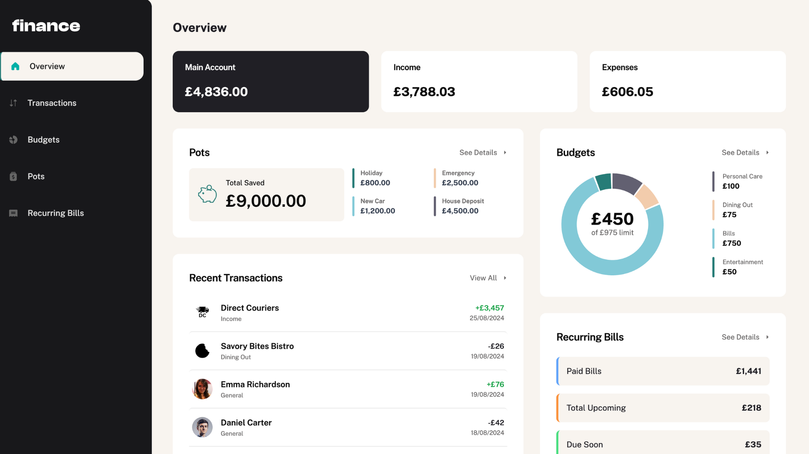

# Finance - Personal Banking & Budget Tracker

A modern personal finance management application that helps you track transactions, manage budgets, and save money with customizable savings pots.



## Tech Stack

- **Frontend**:

  - [Remix](https://remix.run/) - A full-stack web framework
  - [React](https://reactjs.org/) - UI library
  - [TypeScript](https://www.typescriptlang.org/) - For type-safe code
  - [Tailwind CSS](https://tailwindcss.com/) - Utility-first CSS framework
  - [Shadcn UI](https://ui.shadcn.com/) - UI component library

- **Backend**:

  - [Node.js](https://nodejs.org/) - JavaScript runtime
  - [PostgreSQL](https://www.postgresql.org/) - Relational database
  - [Knex.js](https://knexjs.org/) - SQL query builder and migrations

- **Infrastructure**:
  - [Docker](https://www.docker.com/) - Containerization
  - [Docker Compose](https://docs.docker.com/compose/) - Multi-container orchestration

## Features

- **Transaction Management**

  - View and categorize all financial transactions
  - Filter and search functionality
  - Recurring transactions support

- **Budget Management**

  - Create custom budget categories with maximum spend limits
  - Visual representation of budget usage with progress bars
  - Custom themes for different budget categories

- **Savings Pots**

  - Create targeted savings pots with personalized goals
  - Transfer money between main account and pots
  - Track progress towards savings targets

- **Financial Overview**

  - Dashboard with spending insights
  - Visual charts and graphs of financial data
  - Monthly spending breakdown by category

- **User Experience**
  - Modern, responsive UI design
  - Real-time data updates
  - Secure authentication system

## Getting Started

### Prerequisites

- Node.js (v20+)
- Docker and Docker Compose
- npm or yarn

### Setup

1. Clone the repository:

```bash
git clone <repository-url>
cd finance
```

2. Install dependencies:

```bash
npm install
```

3. Set up environment variables:

```bash
# Copy the example environment file
cp .env.example .env

# Edit the .env file with your secure credentials
nano .env
```

4. Start the application with Docker:

```bash
./scripts/docker-start.sh
```

This script will:

- Start PostgreSQL in a Docker container
- Run database migrations and seed data
- Start the Remix development server

5. Open your browser at http://localhost:6001

### Development

Start the development server:

```bash
npm run dev
```

Run with the database:

```bash
npm run dev:docker
```

### Database Management

- Run migrations: `npm run db:migrate`
- Run seeds: `npm run db:seed`
- Rollback migrations: `npm run db:rollback`

## Project Structure

- `/app` - Remix application and components

  - `/components` - React components
  - `/hooks` - Custom React hooks
  - `/routes` - Remix routes
  - `/services` - Business logic
  - `/styles` - Global styles
  - `/types` - TypeScript type definitions
  - `/utils` - Helper functions

- `/db` - Database migrations and seeds
- `/public` - Static assets

## Contributing

1. Fork the repository
2. Create your feature branch: `git checkout -b feature/my-feature`
3. Commit your changes: `git commit -am 'Add my feature'`
4. Push to the branch: `git push origin feature/my-feature`
5. Submit a pull request
